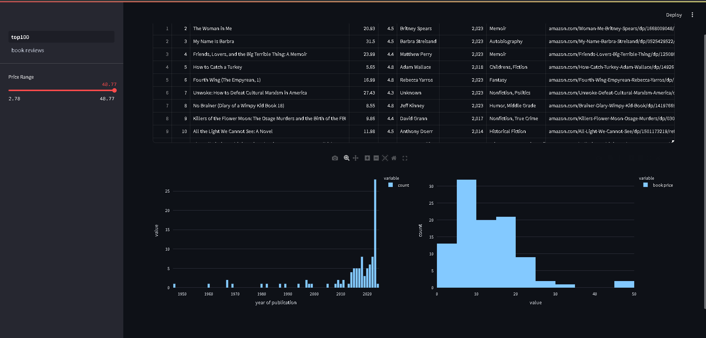
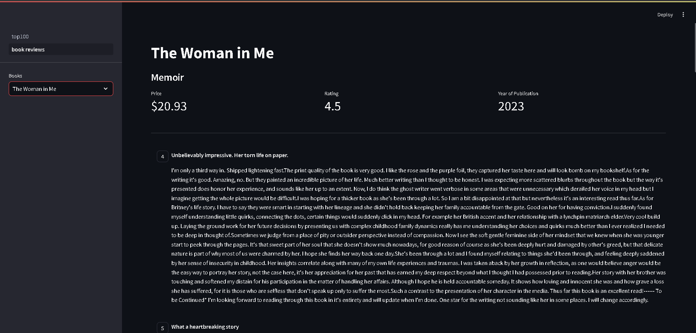

# Do ZERO ao primeiro APLICATIVO WEB

## Mini curso de Python - Asimov Academy

### Análise Interativa de Dados de Livros e Avaliações de Clientes

Este repositório contém dois scripts desenvolvidos em Python utilizando as bibliotecas Streamlit, Pandas e Plotly Express para análise interativa de dados de livros e visualização de avaliações de clientes. Os scripts fornecem uma maneira fácil e eficiente de explorar informações sobre livros e suas respectivas avaliações através de uma interface web.

### Análise de Dados de Livros e Visualização

**Funcionalidades:**

- Filtragem dinâmica dos livros com base no preço máximo selecionado pelo usuário.
- Visualizações interativas utilizando Plotly Express para mostrar a distribuição dos anos de publicação e dos preços dos livros.
- Layout responsivo com duas colunas para apresentação clara das visualizações.

### Detalhes de Livro e Comentários

**Funcionalidades:**

- Seleção de um livro específico através de um seletor de caixa na barra lateral.
- Exibição detalhada das informações do livro como gênero, preço, classificação e ano de publicação.
- Apresentação das avaliações dos clientes incluindo nome do revisor, data da revisão e comentário.

### Screenshots

### Agradecimentos

Agradecimentos especiais ao Rodrigo da Asimov Academy por criar e compartilhar o tutorial original que inspirou este projeto.

[Asimov Academy](https://www.youtube.com/watch?v=VdLen3MV-GM&list=PLuvoZvhxWzZCYMiKtkcMr-aYJ3KV47V0G&index=2&ab_channel=AsimovAcademy)
